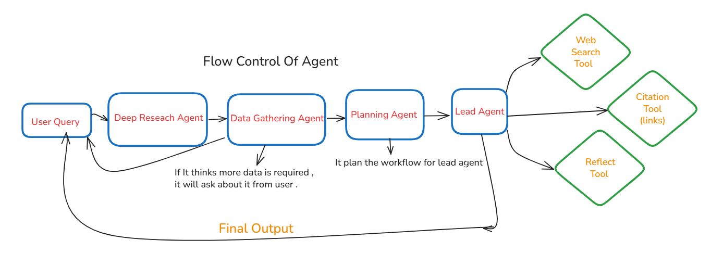

# Deep Research Agent 🔍

This project implements a sophisticated, AI-powered multi-agent system designed to perform deep research on any given topic. The agent leverages a team of specialized AI agents to gather requirements, plan a research strategy, retrieve real-time information from the web and reasoning that increases the brain storming of Agent .



## � Features

- **Multi-Agent System:** Utilizes a team of specialized agents for a structured research process:
    - **Requirement Gathering Agent:** Clarifies and understands the user's research needs.
    - **Planning Agent:** Develops a strategic plan to tackle the research query.
    - **Lead Agent:** Coordinates the workflow between other agents and synthesizes the final report.
- **Advanced Web Search:** Integrates with the Tavily API for accurate, up-to-date information retrieval.
- **Interactive Chat Interface:** A user-friendly interface built with Chainlit for a seamless conversational experience.
- **Real-time Streaming:** Streams responses and thought processes of the agents in real-time.
- **Session and Agentic Memory** It gives the Session as well as Agentic Memory that increase the consistency and performance of the chatbot.
- **Asynchronous Architecture:** Built with `asyncio` for efficient, non-blocking I/O operations, especially for web requests.

## 🛠️ How It Works

The system operates as a pipeline of agents. When a user provides a research query, it's first passed to the `requirement_gathering_agent`. Once the requirements are clear, the `planning_agent` creates a step-by-step research plan. The `lead_agent` then executes this plan, using the available tools to gather information.

### Web Search Tool (`web_search.py`)

A core component of this system is the `web_search` tool, which provides real-time access to web information.

- **Technology:** Here are the technologies used in the Deep Research Chatbot as follows :
1. It uses the `Tavily` Python client to perform efficient and comprehensive web searches.
2. It use the `Mem0` for Agentic Memory . It stores the important data about user .
- **Functionality:** The `web_search` function is an asynchronous tool that takes a search query string.
- **Output:** It fetches search results from the Tavily API, formats them into a clean, readable Markdown format, including the title, a snippet of the content, and a direct link to the source URL. This ensures all information is verifiable.

```python
# Example of a formatted result from web_search
"""
### Title of the Web Page
Snippet of the content from the page...
##### [Source](https://example.com/source-url)
---
"""
```

## � Getting Started

### Prerequisites

- Python 3.13+
- An active internet connection

### ⚙️ Configuration

1.  **Environment Variables:** Create a `.env` file in the root of the project directory and add your API keys:
    ```env
    GEMINI_API_KEY="your_gemini_key_here"
    TAVILY_API_KEY="your_tavily_key_here"
    ```

2.  **Model Settings:** The primary model can be configured in `deep_research_system.py`. The default is set to `gemini-2.5-flash`.
    ```python
    model = OpenAIChatCompletionsModel(
        openai_client=provider,
        model="gemini-2.5-flash"
    )
    ```

### 📦 Installation & Setup

1.  **Clone the repository:**
    ```bash
    git clone <your-repo-url>
    cd _Projects/Deep_Research_Agent
    ```

2.  **Set up a virtual environment:**
    ```bash
    #install uv if you haven't already
    pip install uv

    # Create and activate the virtual environment
    uv venv
    source .venv/bin/activate  # On Unix/macOS
    .venv\Scripts\activate    # On Windows
    ```

3.  **Install dependencies:**
    ```bash
    uv pip install -r requirements.txt 
    ```
    *Note: If a `pyproject.toml` is used for dependencies, you might use `uv install`.*

4.  **Run the application:**
    ```bash
    uv run chainlit run deep_research_system.py
    ```

## 📁 Project Structure

```
---
*This project is for educational and research purposes.*
Deep_Research_Agent/
├── .env                    # Environment variables (API keys)
├── deep_research_system.py # Main application logic and agent definitions
├── main.py                 # CLI Agent (Alternative entry point)
├── pyproject.toml          # Project metadata and dependencies
├── README.md               # This file is for Documentaion
├── research_agents.py      # Definitions for specialized research agents
├── tools.py                # Additional tools for agents
├── uv.lock                 # uv lock file
├── web_search.py           # Web search tool implementation
└── Workflow_of_Agent.png   # Diagram of the agent workflow
```

## 🎯 Usage Examples

You can interact with the agent through the Chainlit interface with queries like:

-   "Analyze the latest developments in quantum computing."
-   "Provide a summary of recent AI regulations in the European Union."
-   "Compare and contrast different approaches to sustainable energy generation."

### How it works
- Tools are defined with `@function_tool`.
- The agent registers: `tools=[web_search, get_info, save_user_memory,search_user_memory]`.
- Local context is passed as a dataclass instance: `Runner.run_streamed(..., context=Info(...))`.
- Inside tools, access context via `Wrapper.context` (type-safe with `RunContextWrapper[Info]`).
- Responses are streamed using `Runner.run_streamed(...).stream_events()`.

### Usage examples
- “Search the latest news about AI regulation and summarize key points.”
- “What is my profile info?” (invokes `get_info` and returns values from `Info`)

### Configuration tips
- Model: adjust `model="gemini-2.5-flash"` in `main.py` as needed.
- Tool choice: `ModelSettings(tool_choice="auto")` lets the model decide when to use tools.
- Temperature: increase for creativity, decrease for factual responses.

## 🔒 Security Best Practices

1. **API Key Management**
   - All API keys stored in `.env`
   - Environment variable validation
   - No hardcoded credentials

2. **Data Privacy**
   - Local context management for sensitive data
   - Minimal PII exposure in prompts
   - Secure data handling in tools

## ❗ Troubleshooting

### Common Issues and Solutions
1. **API Connection Issues**
   - Verify API keys in `.env`
   - Check network connectivity
   - Validate API endpoint status

2. **Agent Behavior Issues**
   - Confirm correct tool registration
   - Check agent configuration
   - Verify model settings

3. **Performance Optimization**
   - Adjust model temperature
   - Fine-tune tool usage settings
   - Optimize search parameters

## 📄 License

MIT License - Feel free to use and modify as needed.

## 👨‍💻 Author

Abdullah Malik (`@AbdullahMalik17`)

---

For bug reports, feature requests, or contributions, please create an issue in the repository.
